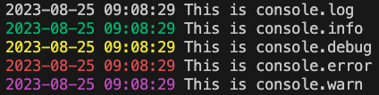

# @lu.se/console-color

Redefine `console.log`, `console.info`, `console.debug`, `console.error`, `console.warn` to use time stamp and colors.

## Example

```js
console.log('This is console.log')
console.info('This is console.info')
console.debug('This is console.debug')
console.error('This is console.error')
console.warn('This is console.error')
```

Outputs:

